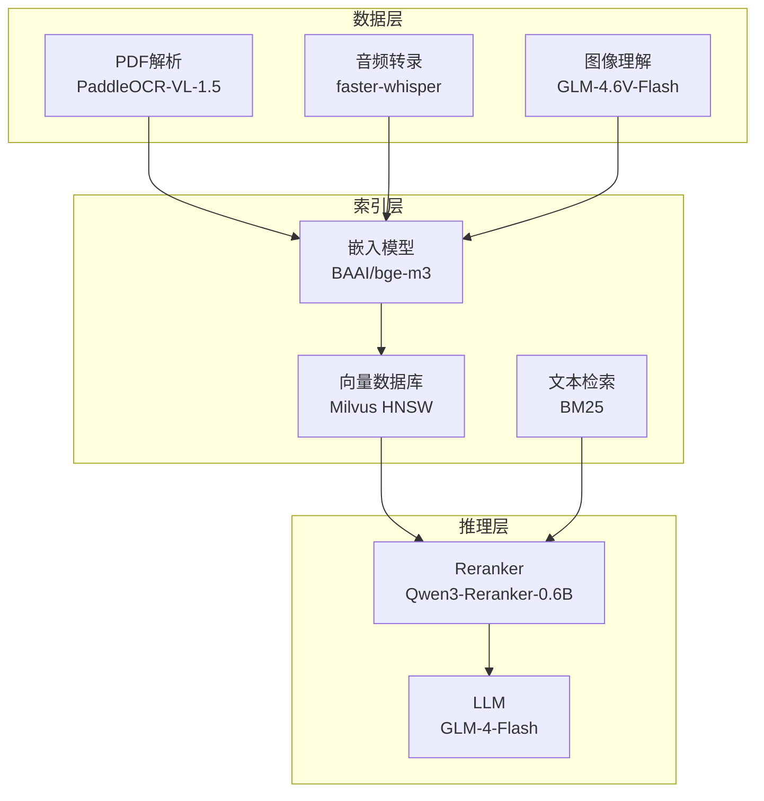
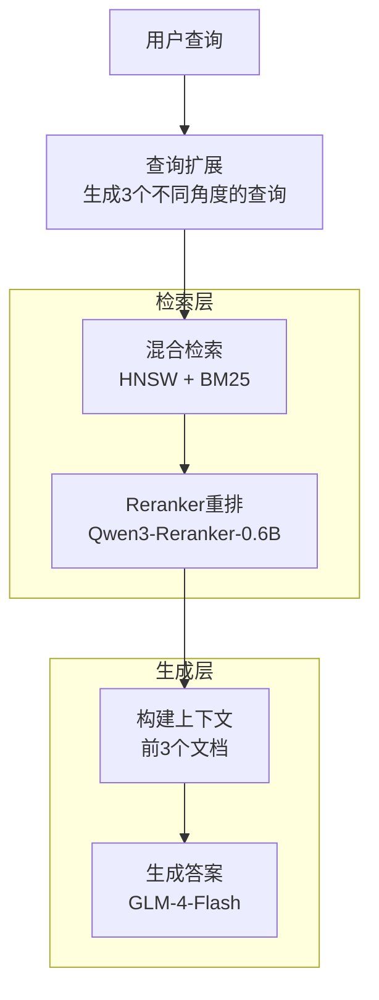

# 🌱 环境数据智能分析助手

基于 RAG-Fusion 的环境政务文档问答系统，支持多模态数据处理与检索增强生成。

## 功能特性

- **多模态数据预处理**：支持 PDF、音频、图像的统一处理
- **父子文档检索**：三层索引结构（父文档-摘要-子块）
- **RAG-Fusion**：查询扩展 + HNSW/BM25 混合检索 + Reranker 重排序
- **Reranker 微调**：基于领域数据的 LoRA 微调
- **多轮对话**：支持上下文记忆的连续问答

## 项目结构

```
├── preprocess/          # 数据预处理
│   ├── main.py          # 入口
│   ├── audio.py         # 音频转录 (faster-whisper)
│   ├── pdf.py           # PDF解析 (PaddleOCR)
│   ├── image.py         # 图片摘要 (GLM-4.6V-Flash)
│   └── merge_md.py      # 合并MD文件
├── index/               # 索引构建
│   └── build_vectorstore.py
├── rag/                 # RAG系统
│   ├── main.py          # 命令行入口
│   ├── app.py           # Streamlit界面
│   ├── config.py        # 配置
│   ├── retriever.py     # 检索器
│   ├── eval_rag.py      # 评估数据生成
│   └── ragas_eval.py    # RAGAS评估
├── finetune/            # 微调数据准备
│   ├── generate_qa.py   # 生成QA对
│   └── mine_negatives.py # 挖掘负样本
```

## 技术栈



| 组件 | 技术 |
|------|------|
| PDF解析 | PaddleOCR-VL-1.5 |
| 音频转录 | faster-whisper |
| 图像理解 | GLM-4.6V-Flash |
| 嵌入模型 | BAAI/bge-m3 |
| LLM | GLM-4-Flash |
| Reranker | Qwen3-Reranker-0.6B |
| 向量数据库 | Milvus (HNSW) |
| 文本检索 | BM25 |

## 快速开始

### 1. 安装依赖

```bash
pip install -r requirements.txt
```

### 2. 配置环境变量

```bash
export ZHIPUAI_API_KEY=your_api_key
```

### 3. 数据预处理

```bash
cd preprocess
python main.py
```

### 4. 构建索引

```bash
cd index
python build_vectorstore.py
```

### 5. 启动服务

**命令行模式：**
```bash
cd rag
python main.py
```

**Web界面：**
```bash
cd rag
streamlit run app.py
```

## 核心流程



## 评估指标

基于 200 份环境政务文档的测试结果：

| 指标 | 数值 |
|------|------|
| Faithfulness | 0.876 |
| Answer Relevancy | 0.869 |
| Context Recall | 0.891 |
| Context Precision | 0.912 |

## Reranker 微调

### 生成训练数据

```bash
cd finetune
python generate_qa.py      # 生成QA对
python mine_negatives.py   # 挖掘负样本
```

### 训练格式

```json
{
  "system": "Judge whether the Document meets the requirements...",
  "input": "<Instruct>: Given a search query...\n<Query>: ...\n<Document>: ...",
  "output": "yes/no"
}
```

## 性能优化

- **Recall@5 提升 52%**：相比纯向量检索
- **NDCG@3 达到 0.94**：Reranker 微调后

## License

MIT
