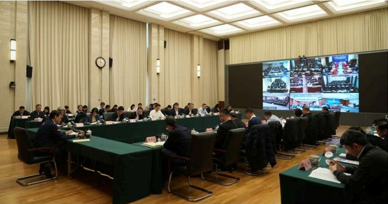

热门搜索：环境影响评价 空气质量

要闻动态

前位置：首页 > 要闻动态 > 环境要闻

# 2026年核与辐射安全监管工作推进会召开

2026-02-04 来源：生态环境部

字号：[大][中][小][打印]

2月3日，生态环境部（国家核安全局）组织召开2026年核与辐射安全监管工作推进会，深入贯彻落实全国生态环境保护工议、核与辐射安全监管工作会议精神，总结2025年工作，系统推进现代化核安全监管体系建设、部署2026年重点任务。生态环部副部长、国家核安全局局长董保同出席会议并讲话。

2025年，在部党组的坚强领导下，核与辐射安全监管各部门和单位守正创新落实习近平总书记重要批示精神和党中央重要部署、严格监管保障核事业高质量发展、固本强基提升核安全监管能力、统筹协调增强核安全治理效能，各方面工作均取得新成效。

2026年是“十五五”开局之年，也是我国核电步入建设投运“双高峰”的第一年。要全面落实习近平总书记重要批示精神彻党的二十大和二十届历次全会精神，深入贯彻习近平生态文明思想和总体国家安全观、核安全观，以实现高水平核安全为目标以夯实核安全主体责任为基础，以化解消除核安全风险隐患为关键，以持续提升核安全基础能力为支撑，以高质量党建为保障，实推进“十五五”核安全规划印发实施、核安全监管力量决策部署落实、法规标准体系现代化建设、重点项目和核设施安全监督辐射安全与环境监管等工作，加快建成同我国核事业发展相适应的现代化核安全监管体系，确保“十五五”核与辐射安全监管量开局。