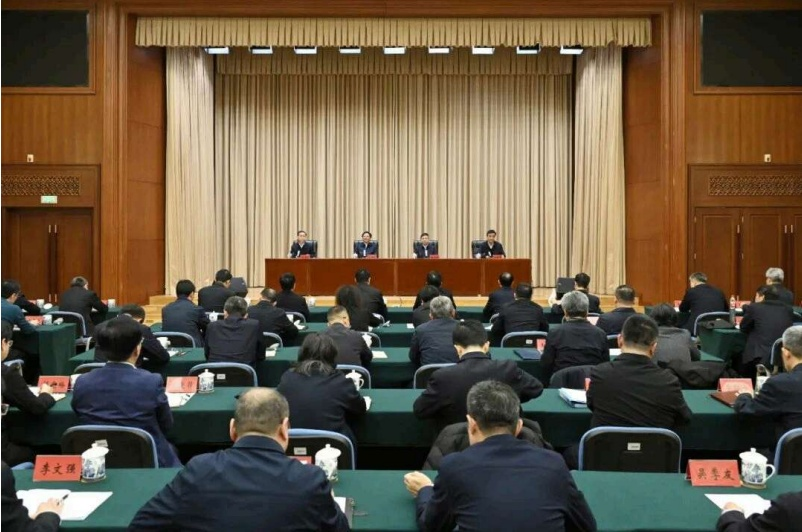

## 要闻动态

前位置：首页 > 要闻动态 > 环境要闻

# 生态环境部召开2026年全面从严治党工作会议

2026-02-05 来源：生态环境部

字号：[大][中][小][打印]

2月5日，生态环境部召开2026年全面从严治党工作会议。会议以习近平新时代中国特色社会主义思想为指导，深入学习贯习近平总书记在二十届中央纪委五次全会上的重要讲话和全会精神，贯彻落实国务院第四次廉政工作会议、中央和国家机关党的工暨纪检工作会议精神，总结生态环境部系统2025年全面从严治党工作，安排部署2026年工作任务。生态环境部党组书记孙金龙部长黄润秋出席会议并讲话。中央纪委国家监委驻生态环境部纪检监察组组长、部党组成员廖西元出席会议并对2026年部系统廉政建设和反腐败斗争提出要求。生态环境部党组成员、副部长董保同主持会议。

孙金龙指出，习近平总书记在二十届中央纪委五次全会上发表重要讲话，着眼基本实现社会主义现代化关键时期，对以更精准、更实举措推进全面从严治党，为实现“十五五”时期目标任务提供坚强保障作出战略部署。生态环境部系统要切实把思想行动统一到习近平总书记重要讲话和全会精神上来，深入贯彻“三个更加”重要要求，坚定不移把党的自我革命向纵深推进。要进一步提高政治站位，更加坚决有力地贯彻落实党中央重大决策部署，以更高站位、更宽视野、更大力度谋划和推进生态环境保护工作。要强化监督执行，更加科学有效地把权力关进制度笼子，推动形成尊崇制度、遵守制度、捍卫制度的良好氛围。要坚持一化进，更加清醒坚定地推进反腐败斗争，以政治清明促生态文明。